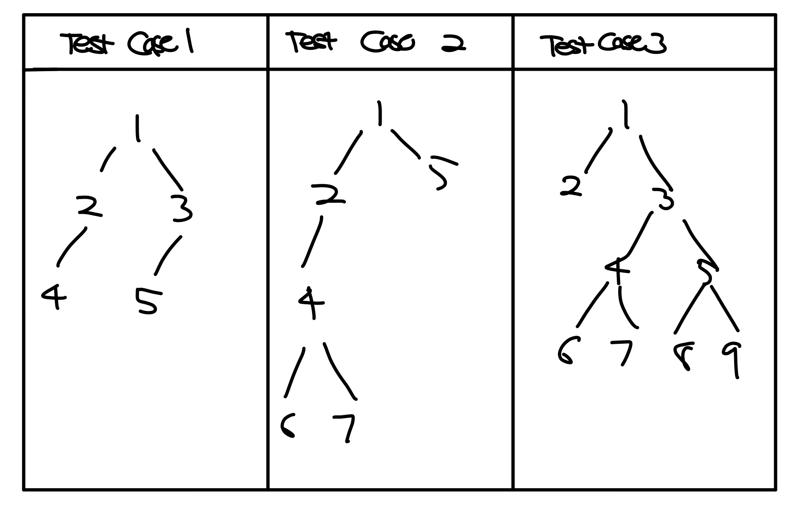

# Binary
## Objective:
Generation of Preorder Traversal from Postorder and Inorder Traversal of Binary Tree

## Usage
Run Example with outputs printed in console (Test Case 1)
<pre><code>$ python main.py </pre></code>
Run Unit Test (3 Unique Examples shown below)
<pre><code>$ python test.py </pre></code>

